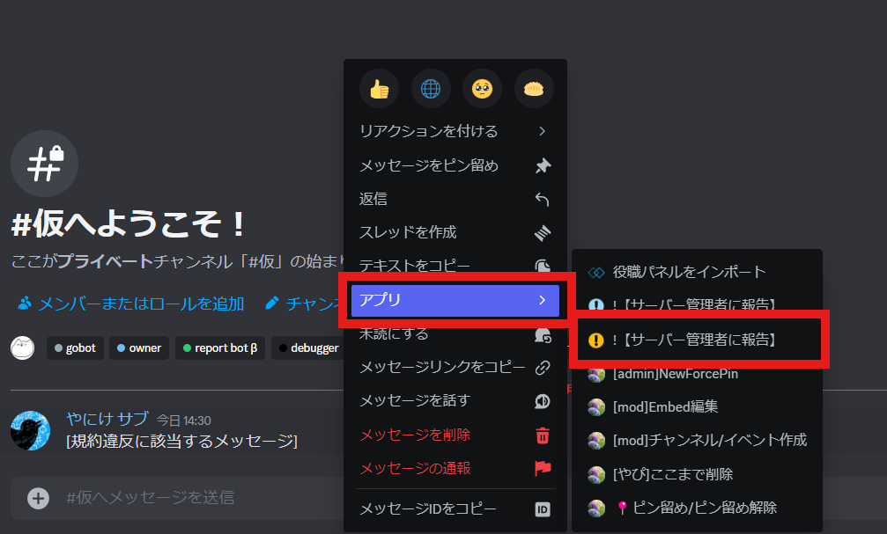
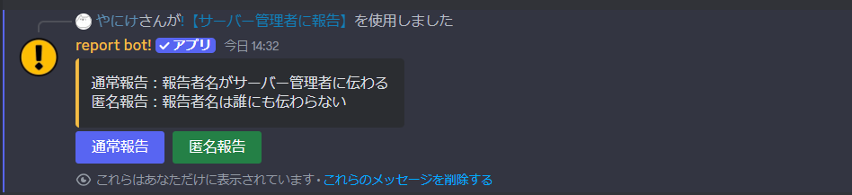

ルール違反したメッセージなどを、サーバー管理者に報告できる機能  
匿名での報告も可能で、サーバー管理者はこのbotを通じて報告者と会話をすることも可能です。


## 使い方
1. 報告したいメッセージを右クリック
1. 「アプリ」
1. 「【サーバー管理者に報告】」

1. 「通常報告」か「匿名報告」かを選ぶ

1. 報告理由を記入

---

## 設定

```
/settings
```