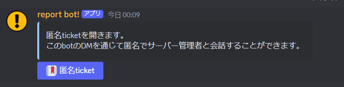
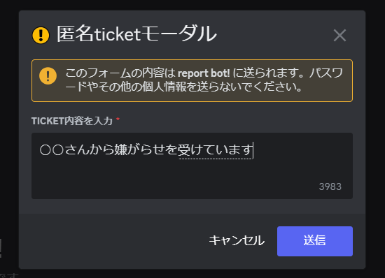

有名bot『Ticket Tool』の匿名版のような機能  
botのDMを通じ、サーバー管理者と会話をすることができます。

---

## 設定

```
/pticket config <config_channel: 必須>
```
- 匿名Ticketを受信するチャンネルを設定
- 匿名Ticketを開始するためのボタンを設置

するコマンドです。
- `サーバー管理`の権限を持っているユーザーしか実行できません。
- 詳しい設定の仕方は[こちら](../quickstart/#匿名ticket機能)


## 使い方
1. '匿名ticket' ボタンを押す


2. ticket内容を入力する


3. DMにて、画像などを送信することができます
