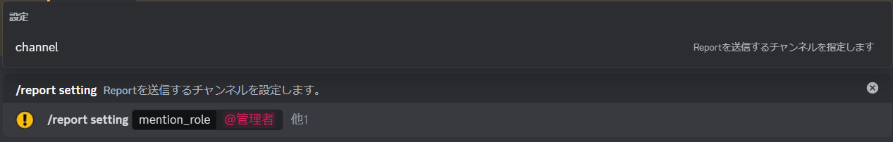

# 1. Report機能の設定

```
/report setting
```
- Reportを受信するチャンネルを設定します


:::info オプション
- channel（任意）
  - 選択しなかった場合は、コマンド実行チャンネルがReport送信チャンネルになります
- mention_role（任意）
  - Reportが作成されたときに、このロールがメンションされます
:::

- 設定が完了するとこのようなメッセージが送信されます
