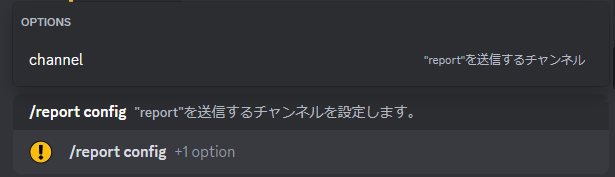
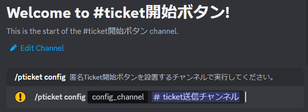
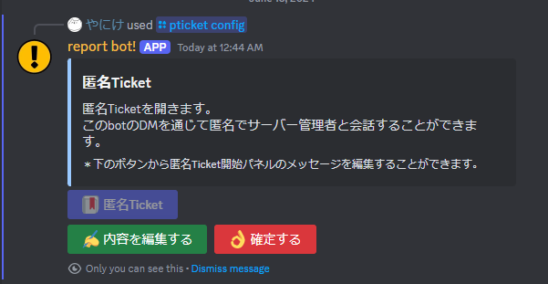
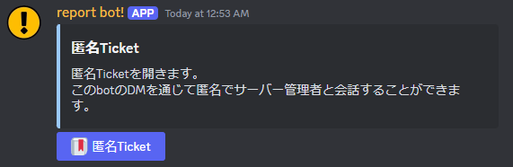

## まず何をすれば良いの？

1. Reportを受信するチャンネル
1. 匿名Ticketを受信するチャンネル, 匿名Ticket開始ボタンを設置するチャンネル  

を設定します。  

---

### Report機能

```
/report config
```
- Reportを受信するチャンネルを設定します


:::info
Reportを受け取りたいチャンネルで実行してください
:::

---

### 匿名Ticket機能
```
/pticket config
```
1. Ticketを受信するチャンネルを指定してください

:::info
匿名Ticketを開始するためのボタンを設置するチャンネルで実行してください
:::

2. 匿名Ticket開始ボタンのパネルメッセージを自由に編集することができます

3. 「確定」ボタンを押すと、以下の様なパネルが生成されます
